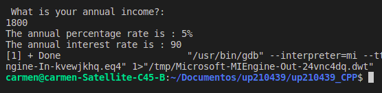
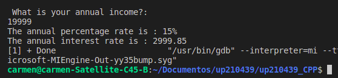
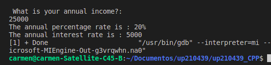
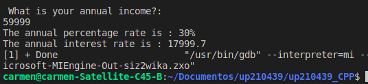

<h1 align="left"> 
EXERCISE 1: Corresponding porcentage according to the amount of rent of the client
<h2> Code structure (C++)</h2>
<div><h4>Input</h4></div>

```c++

    //Library for managing inputs and outputs
    #include <iostream> 

    //Using the namespace to avoid the std::
    using namespace std;

    //integer main function
    int main(){
    
        //Declare variables
        float percentage;
        float rentaAnual;

        // Income variable
        cout << " What is your annual income?: " << endl;
        cin >> rentaAnual;

 ```
 
 <div><h4>Process & Output </h4></div>


```c++

        // Calculate the rent to obtain the percentage
        if (rentaAnual < 10000)
        {
            percentage =.05;
        }
        else if((rentaAnual >= 10000) && (rentaAnual < 20000 ))
        {
            percentage= .15;
        }
        else if((rentaAnual >= 20000) && (rentaAnual < 35000))
        {
            percentage = .20;
        }
        else if((rentaAnual >= 35000) && (rentaAnual < 60000))
        {
           percentage = .30;
        }
        else if(rentaAnual >= 60000 )
        {
            percentage = .45;
        }
    
    //view the results 
    cout << "The annual percentage rate is : " << (percentage*100) << "%" << endl;
    cout << "The annual interest rate is : " << (rentaAnual*percentage) << endl;

    return 0;
    }

```

## Function
<p> Show the user the corresponding porcentaje to pay according to the total amount of rent </p>
<ol>
<li>The user enters the personal amount of rent
<li>The calculations corresponding to the amount entered are performed as follows:
<ol>
<ol type="a">
<li>If the amount is less than $10,000, the porcentaje will be equal to: 5%
<li>If the amount is less than or equal to $10,000 or less than $20,000, the porcentage will be equal to: 15%
<li>If the amount is less than or equal to $20,000 or less than $35,000, the porcentage will be equal to: 20%
<li>If the amount is less than or equal to $35,000 or less than $60,000, the porcentage be equal to: 30%
<li>If the amount is greater than or equal to $60,000, the porcentage will be equal to: 45%
</ol>

<h3> Final results</h3>
<ol type="A>
<li>For amount less than $10,000        
    
<li>For an amount greater than or equal to $10,000 or less than $20,000
      
<li>For an amount greater than or equal to $20,000 or less than $35,000
       
<li>For an amount greater than or equal to $35,000 or less than $60,000
      
<li>For amounts greater than or equal to $60,000
    
</ol>
 
 <br><br><br>                                                 
