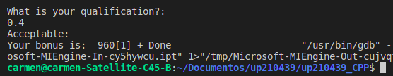
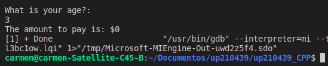

<h1 align="center">
WELCOME TO UNIT 2. 
<h1 align="center"> 
EXERCISE 1: Corresponding porcentage according to the amount of rent of the client.
<h2> Code Structure (C++)</h2>
<div><h4>Input</h4></div>


```c++
    //Library for managing inputs and outputs
    #include <iostream> 

    //Using the namespace to avoid the std::
    using namespace std;

    //integer main function
    int main(){

        //Declare variables
        float percentage;
        float rentaAnual;
 
 ```
 
 <div><h4>Process & Output </h4></div>


```c++
        // Income variable
        cout << " What is your annual income?: " << endl;
        cin >> rentaAnual;
    

        // Calculate the rent to obtain the percentage
        if (rentaAnual < 10000)
        {
            percentage =.05;
        }
        else if((rentaAnual >= 10000) && (rentaAnual < 20000 ))
        {
            percentage= .15;
        }
        else if((rentaAnual >= 20000) && (rentaAnual < 35000))
        {
            percentage = .20;
        }
        else if((rentaAnual >= 35000) && (rentaAnual < 60000))
        {
           percentage = .30;
        }
        else if(rentaAnual >= 60000 )
        {
            percentage = .45;
        }

        //view the results 
        cout << "The annual percentage rate is : " << (percentage*100) << "%" << endl;
        cout << "The annual interest rate is : " << (rentaAnual*percentage) << endl;

        return 0;
    }
        }    
```

## Function ->
<p> Show the user the corresponding porcentage to pay according to the total amount of rent </p>
<ol>
<li>The user enters the personal amount of rent.
<li>The calculations corresponding to the amount entered are performed as follows:
<ol>
<ol type="a">
<li>If the amount is less than $10,000, the porcentage will be equal to: 5%
<li>If the amount is less than or equal to $10,000 or less than $20,000, the porcentage will be equal to: 15%
<li>If the amount is less than or equal to $20,000 or less than $35,000, the porcentage will be equal to: 20%
<li>If the amount is less than or equal to $35,000 or less than $60,000, the porcentage will be equal to: 30%
<li>If the amount is greater than or equal to $60,000, the porcentage will be equal to: 45%
</ol>    
<h3> Results</h3>
<ol type="A>
<li>For amount less than $10,000
    
<li>For an amount greater than or equal to $10,000 or less than $20,000
    
 <li>For an amount greater than or equal to $20,000 or less than $35,000
    
 <li>For an amount greater than or equal to $35,000 or less than $60,000
    
 <li>For amounts greater than or equal to $60,000</li>
    
</ol>
 
<br><br><br>
                                                 
<h1 align="center"> 
EXERCISE 2: Benefits: bonus assigned according to scores.                 
<h2> Code Structure (C++)</h2>
<div><h4>Input</h4></div>

```c++                                                
    //Library for managing inputs and outputs
    #include<iostream>

    //Using the namespace to avoid the std::
    using namespace std;

    //Main function of integer type
    int main(){

    //Variable Declaration
    double c;
 ```

 <div><h4>Process & Output </h4></div>


```c++
    //Enter the rating number
    cout<<"What is your qualification?: " <<endl;
    cin>>c;
    //Execution of the problem
    if ((c == 0)||(c == 0.4)||(c >= 0.6 && c <= 1)){
        if(c == 0){
        cout<<"unattainable: " <<endl;
        }
        else if(c == 0.4){
            cout<<"Acceptable: " <<endl;
        }
        else if(c >= 0.6 && c <= 1){
            cout<<"meritorious: "<<endl;
        }
        cout<<"Your bonus is:  " <<2400*c;
        }

        //If none of the other qualifications are met, it is: 
        else{
            cout<<"invalid: " <<endl;
        }
        return 0;
    }
```
## Function->
<p> This program consists of assigning employees their bonus corresponding to their performance score; the score must be [0.0, 0.4 or greater than 0.6], any other score outside the established ones will be rejected. The percentage equal to your performance score where 100% percent is $2400 and 0% is $0. </p>
<ol>
<ol type="a">                             
<li>User enters their score
<li>If the user enters a value other than 0, 0.4 or a number greater than 0.6, the program will not advance and will throw a warning message
<li>If the user enters a valid value, it prints the corresponding bond along with the amount to which it is creditor
</ol>
<br><br>

<h3> Results</h3>
<ol type="A>
<li>For a score of 0.0
    
<li>For a score of 0.4
    
 <li>For a score of 0.6
    
  </ol>
 
 <br><br><br>
 
<h1 align="center"> 
EXERCISE 3: Tickets: (Price corresponding to pay according to your age). 
<h2> Code Structure (C++)</h2>
<div><h4>Input</h4></div>

```c++
    //Library for managing inputs and outputs
    #include<iostream>

    //Using the namespace to avoid the std::
    using namespace std;

    //Main function of integer type
    int main(){

     //Variable Declaration   
        int age;
        int ca;  //amount of money to pay

        cout<<"What is your age?: " <<endl;
        cin>>age;
    
```

 <div><h4>Process & Output </h4></div>


```c++
        if( age <= 4 ){
            int free = 0;
            ca = free;  

        }
        else if((age >=  4)&&(age <18)){
            ca = 5;
        }
        else if((age >= 18)){
            ca = 10;
        }
        cout<<"The amount to pay is: "<< "$" << (ca) << endl;

        return 0; 
    }
```

## Function->
<p> This program works based on the age entered by the user, depending on their age a price will be assigned to their ticket</p>
<ol>
<ol type="a">    
<li>The user enters his age
<li>The program begins to assign the price that corresponds to it
<li>The price to pay is printed on the screen
<li>If you do not enter an age, it will be wrong    
</ol>
<br><br>
<h3> Results</h3>
<ol type="A>
<li>Age less than 4 = 0 (free).</li>
    
<li>Age over 4 but under 18 = $5 pesos per ticket.</li>
    
<li>Age over 18 = $10 pesos the ticket.</li>
    
</ol>
 
 <br><br><br>
 
                                                   
<h1 align="center"> 
EXERCISE 4: Pizza: (Sample of the menu according to the client's selection).
<h2> Code Structure (C++)</h2>
<div><h4>Input</h4></div>

```c++                                                   
    #include<iostream>

    using namespace std;

    int main (){
    //----Declaration of variables----
        int pizza;
        int ingredientes;

        //Request rental amount from the user
        cout << "Do you want a Vegetarian (Digit 1) or Non-Vegetarian (Digit 2) pizza)?" << endl;
        cin >> pizza;
```

 <div><h4>Process & Output </h4></div>


```c++                                                                                        
        //Printing of the selected menu
        if (pizza == 1)
        {
            cout << "Vegetarian Ingredients: " << endl;
            cout << "2. Pepper" << endl;
            cout << "3. Tofu" << endl;
            cout << "Enter the number of the ingredient of your choice: " << endl;
            cin >> ingredientes;
            if (ingredientes == 2)
            {
                cout << "ORDEN:" << endl;
                cout << "Vegetarian pizza" << endl;
                cout << "Ingredients: " << endl;
                cout << "Mozzarella cheese, tomato sauce and pepper" << endl;

            }
            else
            {      
                cout << "ORDEN:" << endl;
                cout << "Vegetarian pizza" << endl;
                cout << "Ingredients: " << endl;
                cout << "Mozzarella cheese, tomato sauce and tofu" << endl;
            }
        }
        else if (pizza == 2)
        {
            cout << "Non Vegetarian Ingredients: " << endl;
            cout << "4.Pepperoni" << endl;
            cout << "5.Ham" << endl;
            cout << "6.Salmon" << endl;
            cout << "Enter the number of the ingredient of your choice: " << endl;
            cin >> ingredientes;
            if (ingredientes == 4)
            {
                cout << "ORDEN:" << endl;
                cout << "Non Vegetarian Pizza" << endl;
                cout << "Ingredients: " << endl;
                cout << "Mozzarella cheese, Tomato sauce and Pepperoni" << endl;
            }
            else if (ingredientes == 5)
            {
                cout << "ORDEN:" << endl;
                cout << "Non Vegetarian Pizza" << endl;
                cout << "Ingredients: " << endl;
                cout << "Mozzarella cheese, Tomato sauce and Ham" << endl;
            }
            else
            {
                cout << "ORDEN:" << endl;
                cout << "Non Vegetarian Pizza" << endl;
                cout << "Ingredients: " << endl;
                cout << "Mozzarella cheese, Tomato sauce and salmon" << endl;
            }
        }
        else
        {
            cout << "Try again" << ":(" << endl;
        }


        return 0;  
    }
```
## Function->
<p> This program is based on taking the client's order with the established options and at the end its complete order is printed to be seen by the user.</p>
<ol>
<ol type="a">                                       
<li>The program asks the user what type of pizza he wants
<li>With the previous information, the menu corresponding to this selection is displayed.
<li>At the end, the user can view their complete order to check that it is correct.
</ol>
<br><br>
<h3> Results</h3>
<ol type="A>
<li>Vegetarian pizza: peper(Mozzarella cheese, tomato sauce and tofu).
    
<li>Vegetarian pizza: tofu (Mozzarella cheese, tomato sauce and tofu).
    
<li>Non-vegetarian pizza: pepperoni (Mozzarella cheese, Tomato sauce and Pepperoni).
    
<li>Non-vegetarian pizza: Ham (Mozzarella cheese, Tomato sauce and Ham).
    
<li>Non-vegetarian pizza: salmon (Mozzarella cheese, tomato sauce and salmon).
    
</ol>
 
<br><br><br>

<h1 align="center"> 
EXERCISE 5: Temperatures: calculation of the average, minimum and maximum amount according to the temperature given by the user.  
<h2> Code structure (C++)</h2>
<div><h4>Input</h4></div>

```c++

    //Library for managing inputs and outputs
    #include <iostream>

    //Using the namespace to avoid the std::
    using namespace std;

    //Main function of integer type
    int main(){
        //Variable Declaration 
        int cont =1;
        int lower = 99999;
        int higher = 0; 
        float temperature;
        float tempAcum =0;

```
<div><h4>Process & Output </h4></div>


```c++    
        do{
            cout << "Give me the temperature: ";
            cin >> temperature; 
            tempAcum += temperature;  

            cont ++;
            if (temperature <= lower)
            {
                lower = temperature;
            }
            if (temperature >= higher)
            {
                higher = temperature;
            } 
        }   while(cont <= 6);

        //print results
        cout << " The mean is " <<tempAcum/6<< endl;
        cout << " lower temperature is: " <<lower<< endl;
        cout << " hingher temperature is: " <<higher<< endl;


        return 0;
    }
```
## Function->
<p> This program collects temperatures given by the user to carry out the following procedure</p>
<ol>
<ol type="a">    
<li>The program adds these temperatures to calculate the average between them -> (User enters 6 temperatures).
<li>The program does a search between the highest and the lowest temperature.
<li>Finally the results are printed.
</ol>
<br><br>    
<h3>Results</h3>   
a. As the first value enter very low temperatures and very high temperatures. 
<div align ="left">       
     
</div>      
b. Second try.
<div align ="left">     
     
</div>     
<br><br><br>
 
                                                  
//Library for managing inputs and outputs
#include<iostream>

//Using the namespace to avoid the std::
using namespace std;

//Main function of integer type
int main(){

 //Variable Declaration 
 int productQuantity =0;
 int totalBills;
 int price =0;
 int cont = 1; 
 int Exit = 0;  

do
{
    
cout << "Enter the quantity of product: " <<endl;
cin >> productQuantity;

if(productQuantity !=0 & productQuantity > 0){

    cout << "Enter the price of your product: " << endl;
    cin >> price;
}
else { 
    cout<< "Wrong try again: " << endl; 
}

totalBills += price*productQuantity; 

} while (productQuantity > 0);

cout << "The total bills is: " << "$" << totalBills <<endl;

return 0;

}

//Library declaration
#include<iostream>

//statement to avoid std
using namespace std;

int main(){
     int num;
    string result;

    do{

        cout<<"Enter the number to convert: ";
        cin>>num;

        if(num>0){
            cout<<"elderly to zero"<<endl; 
            while(num!=0){
            if(num%2==0){
            //The current result with the previous
            result='0'+result;
            }
            else 
            result='1'+result;
            num/=2;
            
        }
        }
        else if(num==0){
            cout<<"0"<<endl;
        }
        else{
            cout<<"smaller to zero"<<endl;
        }
   
    

    }while(num<0);
    cout<<result<<endl;


    return 0;
 }


 #include <iostream>

using namespace std;

int main(){

    //--Declarar variables--
    int limite, num, result;

    //--ingresar el número (que tan grande será la tabla--
    cout << "What number do you want the table to be: " <<endl;
    cin >> num;

    //Ingresar el limite que quiero 
    cout << "Enter the limit: " <<endl;
    cin >> limite; 

    //--contador es igual a 1, contador menor o igual a 15, al contador se le va sumando-- 
    for (int i = 0; i <= limite; i++)
    {
       for(int f = 1; f <= 48; f++)
    {
        cout << "-";     
    }
    cout<<endl;

    result=num*i;
        cout << "| " << "\t" << i << "\tX" << "\t" << num << "\t=" << "\t" << result << "\t" << "|" <<endl;
    }
    
    return 0; 
}

.
