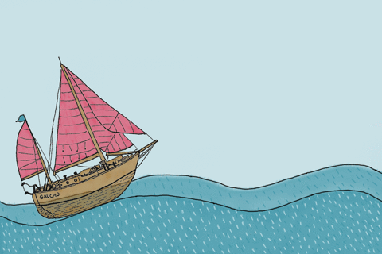
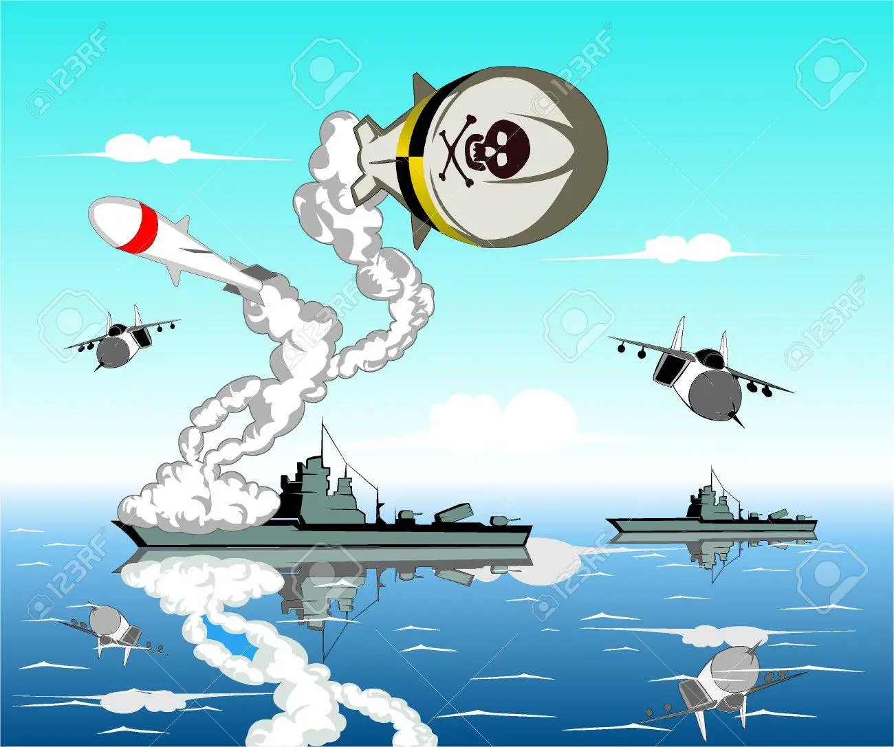

<div align ="center">  

```c++

 █▄▄ ▄▀█ ▀█▀ ▀█▀ █░░ █▀▀   █▀ █░█ █ █▀█
  █▄█ █▀█ ░█░ ░█░ █▄▄ ██▄   ▄█ █▀█ █ █▀▀ 

```    

</div>
<div align ="center">

</div>   
<br /><br /><br />  

<div align ="center">  

# INDEX
</div>  

 1. [CODE BATTLE SHIP](main.cpp)
 2. [INSTRUCTIONS](#introductions)  
   2.1 [HOW TO PLAY (WINDOWS)](#how-to-play-windows)    
3. [FLOWCHART](#flowchart)
4. [CODE EXECUTION](#code-execution)
5. [CONCLUSION](#conclusion)    

<br /><br /><br />  

# INTRODUCTIONS  

# HOW TO PLAY (WINDOWS)  
1. Download the DEV C++ app for Windows  
  https://sourceforge.net/projects/orwelldevcpp/  
2. Then download the game code, you can get it from the "CODE BATTLE SHIP" index.  
3. When entering the code it tells you "Press to start the game", then a menu appears which gives you the options to play against an opponent or against the CP.
4. May the best man win and have fun  &#128512;

 
_Objective of the game_  &#9728;  
1. Sink your opponent's ships, before he finishes yours
2. Each player has a board (with 10 rows and 10 columns).  
   _Note: Your board is the "position board" and your opponent's is the "main board."_
3. Before starting the gThe player who sinks all the ships wins and there is no tie here your opponent's ships with movements (shots).
6. The player who sinks all the ships wins and there is no tie here.
  
<div align ="center">

</div>  
 
  <br /><br /><br />  

[RETURN TO INDEX](#index)  

# FLOWCHART   
<br /><br /><br />   

[RETURN TO INDEX](#index)  }

# CODE EXECUTION  
<div align ="center"> 
 
 
1). First attempt, game execution.
 
 


2). Enter the enter key to start the game.
 
 


3). The boards are shown with instructions on how to position the ships, shoot and move.
 
 


4). Shows when the machine beat you.
 
 

 
 5). At the end of the game, it shows you how the play ended when you pressed (2/No).
 
 


</div> 


<br /><br /><br />   

[RETURN TO INDEX](#index)  

# CONCLUSION   
Finally, the objective of the realization of this game was to put into practice the learning that we obtained in class, such as: the functions and structures of the cycles, for, while, do while, if. We also saw other functions that served to give it a better presentation, color to the board, animations, in the end the frontend and backend code were combined. A flowchart was developed to have a better explanation about the development of the game.
It was not easy since we had to give him intelligence.   
 
<br /><br /><br />  

[RETURN TO INDEX](#index)

   

